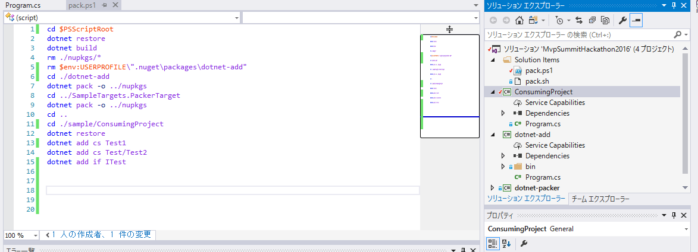

# Hackathon Result - "dotnet add" CLI extension

When I develop .NET Core app on Linux, there's no Visual Studio, so I'm bothering to add a cs file. I make "dotnet add" extension as a PoC during MVP Summit 2016 Hackathon.



## Usage
```
> dotnet add cs <ClassName>
> dotnet add cs <Dir>/<ClassName>
> dotnet add if <InterfaceName>
```

## Limitation
This toolset requires csproj supporting .NET Core 1.1, so almost of Linux platforms are not supported yet. I'm looking forwart to next .NET Core 1.1 preview release.

# Extensibility of the CLI toolset - sample for the hackathon

This repository contains the basic sample of an extension to the MSBuild edition of the [CLI toolset for .NET Core](https://github.com/dotnet/cli). The idea of the repo is to provide an easy way to get started with developing extensions to the CLI and the SDK in terms of both MSBuild targets as well as "classic" tools that can be invoked using the `dotnet-<command>` invocation pattern.

The extension in question is a proof-of-concept tool that allows the user to package a published application as a zip file. It is implemented as:

1. A target that depends on the publish target from the SDK
2. A tool that allows the user to invoke the target as `dotnet packer`

## Testing it out

While in the solution folder, run the following:

```bash
./pack.sh 
cd sample/ConsumingProject
dotnet restore
dotnet packer
```

> **Note:** if you are using Windows, use `pack.ps1` script instead of the \*.sh one.

## SampleTargets.PackerTarget
This folder contains the target implementation. It also specifies configuration within the project file to package the needed files into a nuget package. Note the `build` folder in there. It contains the targets that will extend the project file. You can read more about this approach on [NuGet documentation](https://docs.nuget.org/ndocs/create-packages/creating-a-package#including-msbuild-props-and-targets-in-a-package). 

You can create a nupkg out of this project by simply using the `dotnet pack` command.

## dotnet-packer
This is a very simple console application that allows the user to invoke MSBuild without having to learn MSBuild invocation syntax. It also demonstrates an approach to building CLI tools that can interact with the targets extensions. 

You can create a nupkg out of this project by simply using the `dotnet pack` command.

## A short FAQ

### Is the tool neccessary if I just want to create a target?
No, it is not. You can have a target project just include the target and invoke it using `dotnet msbuild /t:<target-name>`. The tool is just a nicer user experience. 

### When should I use which one?
Targets should be used if your extension depends on something from the build process (e.g. output) or if it needs/wants to extend something in the build process (e.g. run after a given step, depend on a given step). 

A tool should be used in those situations where there is no need to interact with the build process. 


